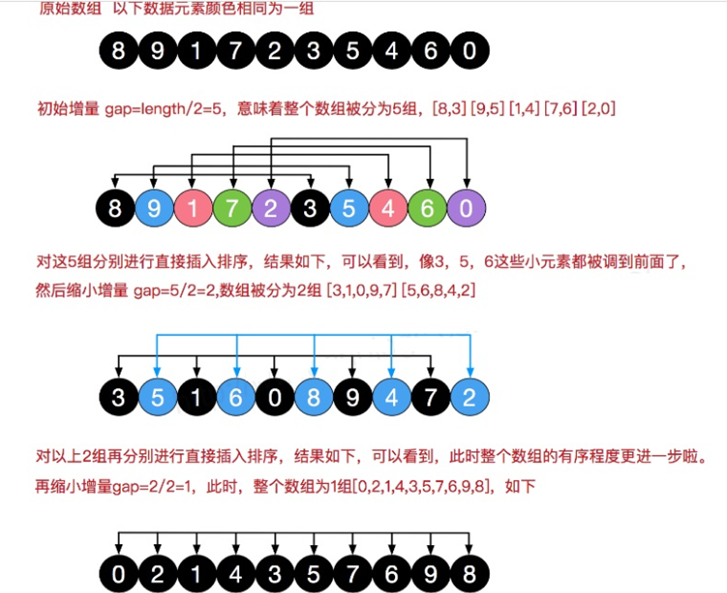
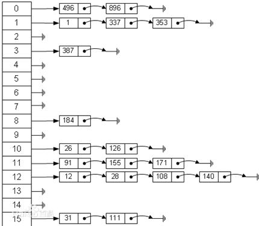

数据结构

## 稀疏数组


+ 二维数组 转 稀疏数组的思路
  + 遍历 原始的二维数组，得到有效数据的个数 sum
  + 根据sum 就可以创建 稀疏数组 sparseArr  int[sum + 1] [3]
  + 将二维数组的有效数据数据存入到 稀疏数组

+ 稀疏数组转原始的二维数组的思路
  + 先读取稀疏数组的第一行，根据第一行的数据，创建原始的二维数组，比如上面的 chessArr2 = int [11][11]
  + 在读取稀疏数组后几行的数据，并赋给 原始的二维数组 即可.

## 简单的排序算法


### 冒泡算法

冒泡排序是一种简单的排序算法。它重复地走访过要排序的数列，一次比较两个元素，如果它们的顺序错误就把它们交换过来。走访数列的工作是重复地进行直到没有再需要交换，也就是说该数列已经排序完成。这个算法的名字由来是因为越小的元素会经由交换慢慢“浮”到数列的顶端。

```java
package com.ntuzy.sort;

import java.util.Arrays;

/**
 * 冒泡排序
 */
public class BubbleSort {
    public static void main(String[] args) {
        int[] arr = {11, 48, 15, 7};
        sort(arr);
    }

    public static void sort(int[] arr) {
        if (arr == null || arr.length == 0) {
            return;
        }

        // 外层的for循环指的是进行冒泡操作的轮数  数组的长度-1
        // 最后一个元素是不需要操作的
        for (int i = 0; i < arr.length - 1; i++) {
            // 内层的for循环是每一轮冒泡操作中两两数据比较与数据交换
            for (int j = 0; j < arr.length - 1 - i; j++) {
                if (arr[j] > arr[j + 1]) {
                    int temp = arr[j];
                    arr[j] = arr[j + 1];
                    arr[j + 1] = temp;
                }
            }
        }
        System.out.println(Arrays.toString(arr));
    }
}
```

### 选择排序

表现最稳定的排序算法之一，因为无论什么数据进去都是O(n2)的时间复杂度，所以用到它的时候，数据规模越小越好。唯一的好处可能就是不占用额外的内存空间。

选择排序是一种简单直观的排序算法。它的工作原理：首先在未排序序列中找到最小（大）元素，存放到排序序列的起始位置，然后，再从剩余未排序元素中继续寻找最小（大）元素，然后放到已排序序列的末尾。以此类推，直到所有元素均排序完毕。


```java
package com.ntuzy.sort;

import javax.rmi.CORBA.Util;
import java.util.Arrays;

/**
 * 选择排序
 */
public class SelectionSort {
    public static void main(String[] args) {
        int[] arr = {11, 48, 15, 7};
        sort(arr);
    }
    public static void sort(int[] arr) {
        if (arr.length == 0) {
            return;
        }
        // 定义选择排序需要的轮数 数组的长度
        for (int i = 0; i < arr.length; i++) {
            int minIndex = i;
            // 每一轮选择数据排序进行数据比较
            for (int j = i; j < arr.length; j++) {
                if (arr[j] < arr[minIndex]) {
                    minIndex = j;
                }
                Utils.swap(arr, i, j);
            }
        }
        System.out.println(Arrays.toString(arr));
    }
}
```

### 插入排序

插入排序（Insertion-Sort）的算法描述是一种简单直观的排序算法。它的工作原理是通过构建有序序列，对于未排序数据，在已排序序列中从后向前扫描，找到相应位置并插入。插入排序在实现上，通常采用in-place排序（即只需用到O(1)的额外空间的排序），因而在从后向前扫描过程中，需要反复把已排序元素逐步向后挪位，为最新元素提供插入空间。


```java
package com.ntuzy.sort;

import java.util.Arrays;

public class InsertSort {

    public static void main(String[] args) {
        int[] arr = {11, 48, 15, 7};
        sort(arr);
    }


    public static void sort(int[] arr) {

        if (arr.length == 0) {
            return;
        }

        // 设置当前的元素
        int current;
        for (int i = 0; i < arr.length - 1; i++) {
            current = arr[i + 1];
            int preIndex = i;
            while (preIndex >= 0 && current < arr[preIndex]) {
                // 需要将上一元素进行下移操作
                arr[preIndex + 1] = arr[preIndex];
                preIndex--;
            }
            arr[preIndex + 1] = current;
        }

        System.out.println(Arrays.toString(arr));

    }
    
    
    public static void sort2(int[] arr) {

        for (int i = 0; i < arr.length; i++) {
            // 定义第一个插入的数
            int insertVal = arr[i];
            int insertIndex = i - 1; // arr[1] 的前面这个数的下标

            // insertVal
            // 保证在insertVal 找插入位置时不越界
            // 说明待插入的数没有找到适当的位置
            // 就需要将insertIndex 向后移动
            while (insertIndex >= 0 && insertVal < arr[insertIndex]) {
                arr[insertIndex + 1] = arr[insertIndex];
                insertIndex--;
            }

            arr[insertIndex + 1] = insertVal;
        }

        System.out.println(Arrays.toString(arr));

    }

}
```

###   希尔排序

希尔排序是希尔（Donald Shell）于1959年提出的一种排序算法。希尔排序也是一种插入排序，它是简单插入排序经过改进之后的一个更高效的版本，也称为缩小增量排序，同时该算法是冲破O(n2）的第一批算法之一。它与插入排序的不同之处在于，它会优先比较距离较远的元素。希尔排序又叫缩小增量排序



```java
package com.ntuzy.sort;

import java.util.Arrays;

/**
 * 希尔排序
 */
public class ShellSort {
    public static void main(String[] args) {
        int[] arr = {11, 48, 15, 7};
        sort(arr);
    }

    public static void sort(int[] arr) {
        int len = arr.length;
        int temp;
        int gap = len / 2;
        while (gap > 0) {
            for (int i = gap; i < len; i++) {
                int preIndex = i - gap; // 此时为0
                temp = arr[i];
                while (preIndex >= 0 && arr[preIndex] > temp) {
                    arr[preIndex + gap] = arr[preIndex];
                    preIndex -= gap;
                }
                arr[preIndex + gap] = temp;
            }
            gap /= 2;
        } 
        System.out.println(Arrays.toString(arr)); 
    }
   
     public static void sort2(int[] arr) {

        for (int gap = arr.length / 2; gap > 0; gap /= 2) {
            for (int i = gap; i < arr.length; i++) {
                for (int j = i - gap; j >= 0; j -= gap) {
                    // 如果当前元素大于加上步长的那个元素 说明交换
                    if (arr[j] > arr[j + gap]) {
                        int temp = arr[j];
                        arr[j] = arr[j + gap];
                        arr[j + gap] = temp;
                    }
                }
            }
        }

        System.out.println(Arrays.toString(arr));
     }
}
```

### 快速排序

**快**速排序（Quicksort）是对冒泡排序的一种改进。基本思想是：通过一趟排序将要排序的数据分割成独立的两部分，其中一部分的所有数据都比另外一部分的所有数据都要小，然后再按此方法对这两部分数据分别进行快速排序，整个排序过程可以递归进行，以此达到整个数据变成有序序列


```java
public static int[] quickSort2(int[] arr, int left, int right) {
        int l = left;
        int r = right;
        int pivot = arr[(left + right) / 2];
        int temp = 0;
        while (l < r) {
            // 在pivot左边一直找 找到大于等于pivot的值 才退出
            while (arr[l] < pivot) {
                l += 1;
            }

            while (arr[r] > pivot) {
                r -= 1;
            }

            // 如果 l>=r成立 说明pivot左右两边的值已经按照左边全部都是小于等于pivot的值 右边大于等于pivot的值
            if (l >= r) {
                break;
            }

            // 交换
            temp = arr[l];
            arr[l] = arr[r];
            arr[r] = temp;

            // 如果交换完后 发现arr[l] == pivot的值 r-- 前移
            if (arr[l] == pivot) {
                r -= 1;
            }

            // 如果交换完后 发现arr[] == pivot的值 l++ 前移
            if (arr[r] == pivot) {
                l += 1;
            }
        }

        // 如果 l==r 必须l++ r-- 否则栈溢出
        if (l == r) {
            l += 1;
            r -= 1;
        }

        // 向左递归
        if (left < r) {
            quickSort2(arr, left, r);
        }

        // 向右递归
        if (right > l) {
            quickSort2(arr, l, right);
        }

//        System.out.println(Arrays.toString(arr));

        return arr;

    }
```


### 归并排序

**归**并排序（MERGE-SORT）是利用归并的思想实现的排序方法，该算法采用经典的分治（*divide-and-conquer*）策略（分治法将问题分(divide)成一些小的问题然后递归求解，而治(conquer)的阶段则将分的阶段得到的各答案"修补"在一起，即分而治之)。


```java
public class MergetSort {
    public static void main(String[] args) {
        int[] arr = {8, 4, 5, 7, 1, 3, 6, 2};
        int[] temp = new int[arr.length];
//        System.out.println(1 << 3);
        mergeSort(arr, 0, arr.length - 1, temp);


        System.out.println(Arrays.toString(arr));

    }


    // 分+合
    public static void mergeSort(int[] arr, int left, int right, int[] temp) {
        if (left < right) {
            int mid = (right + left) / 2;
            // 先向左递归
            mergeSort(arr, left, mid, temp);
            // 向右递归分解
            mergeSort(arr, mid + 1, right, temp);

            // 到合并
            merge(arr, left, mid, right, temp);
        }
    }


    /**
     * 合并
     *
     * @param arr   排序的原始数组
     * @param left  左边后续徐立德初始索引
     * @param mid   中间索引
     * @param right 右边索引
     * @param temp  左中转的数组
     */
    public static void merge(int[] arr, int left, int mid, int right, int[] temp) {
        int i = left;  // 初始化i 左边有序序列的索引
        int j = mid + 1;
        int t = 0;

        // 先把左边两边的数据按照规则填充到temp数组
        // 直到左右两边的有序序列 有一边处理完毕为止
        while (i <= mid && j <= right) {
            if (arr[i] <= arr[j]) {
                temp[t] = arr[i];
                t += 1;
                i += 1;
            } else {
                temp[t] = arr[j];
                t += 1;
                j += 1;
            }
        }


        // 把有剩余数据的一边的数据一次全部填充到temp
        while (i <= mid) { // 左边的有序序列还有剩余的数组
            temp[t] = arr[i];
            t += 1;
            i += 1;
        }

        while (j <= right) {
            temp[t] = arr[j];
            t += 1;
            j += 1;
        }


        // 将temp数组元素拷贝到arr
        t = 0;
        int tempLeft = left;
        while (tempLeft <= right) {
            arr[tempLeft] = temp[t];
            t += 1;
            tempLeft += 1;
        }

    }

}
```


### 基数排序

+ [基](https://baike.baidu.com/item/基数排序/7875498)[数排序](https://baike.baidu.com/item/基数排序/7875498)（radix sort）属于“分配式排序”（distribution sort），又称“桶子法”（bucket sort）或bin sort，顾名思义，它是通过键值的各个位的值，将要排序的[元素分配](https://baike.baidu.com/item/元素分配/2107419)至某些“桶”中，达到排序的作用
+ 基数排序法是属于稳定性的排序，基数排序法的是效率高的稳定性排序法
+ 基数排序(Radix Sort)是**[桶排序](http://www.cnblogs.com/skywang12345/p/3602737.html)**的扩展
+ 基数排序是1887年赫尔曼·何乐礼发明的。它是这样实现的：将整数按位数切割成不同的数字，然后按每个位数分别比较。

```java
public static void radixSort(int[] arr) {

        // 根据前面的推导
        // 得到数组中最大数的位数
        int max = arr[0];
        for (int i = 0; i < arr.length; i++) {
            if (max < arr[i]) {
                max = arr[i];
            }
        }

        // 得到最大数的位数
        int maxLength = (max + "").length();

        for (int i = 0, n = 1; i < maxLength; i++, n *= 10) {
            // 第i轮排序
            // 定义一个 10 二维数组代表一个桶

            int[][] bucket = new int[10][arr.length];

            // 为了记录每个桶实际存放了多少个数据  我们定义一个一维数组记录每次放入的数据个数
            // bucketElementCounts[0] 就是bucket[0] 放入数据的股份数
            int[] bucketElementCounts = new int[10];

            for (int j = 0; j < arr.length; j++) {
                int digitOfElement = arr[j] / n % 10;
                // 放入对应同
                bucket[digitOfElement][bucketElementCounts[digitOfElement]] = arr[j];
                bucketElementCounts[digitOfElement]++;
            }
            // 按照这个桶的的顺序 一维数组的下表一次取出数据 放入原来数组
            int index = 0;
            // 遍历每一桶 并将桶中数据放入到原数组中
            for (int k = 0; k < bucketElementCounts.length; k++) {
                // 如果桶中有数据 我们菜放入到原数组
                if (bucketElementCounts[k] != 0) {
                    // 循环该桶
                    for (int l = 0; l < bucketElementCounts[k]; l++) {
                        // 取出元素放入到arr
                        arr[index++] = bucket[k][l];
                    }
                }
                // 第i轮处理后 需要将每个buckElementCounts[k] 置 0
                bucketElementCounts[k] = 0;
            }
        }

        System.out.println(Arrays.toString(arr));

    }
```


## 栈和队列

### 栈

+ 栈的英文为(stack)
+ 栈是一个**先入后出**(FILO-First In Last Out)的有序列表。
+ 栈(stack)是限制线性表中元素的插入和删除**只能在线性表的同一端**进行的一种特殊线性表。允许插入和删除的一端，为变化的一端，称为**栈顶**(Top)，另一端为固定的一端，称为**栈底**(Bottom)。
+ 根据栈的定义可知，最先放入栈中元素在栈底，最后放入的元素在栈顶，而删除元素刚好相反，最后放入的元素最先删除，最先放入的元素最后删除


```java
class ArrayStack {
    private int maxSize; // 栈大小
    private int[] stack;  // 数组模拟栈
    private int top = -1;  // top表示栈顶

    public ArrayStack(int maxSize) {
        this.maxSize = maxSize;
        stack = new int[this.maxSize];
    }


    public boolean isFull() {
        if (top == maxSize - 1) {
            return true;
        }
        return false;
    }

    public boolean isEmpty() {
        return top == -1;
    }


    public void push(int value) {
        if (isFull()) {
            return;
        }

        this.stack[++top] = value;
    }

    public int pop() {

        if (isEmpty()) {
            throw new RuntimeException("stack empty");
        }

        int value = this.stack[top];
        top--;
        return value;
    }


    // 需要从栈顶开始显示
    public void display() {
        if (isEmpty()) {
            return;
        }

        for (int i = top; i >= 0; i--) {
            System.out.printf("stack[%d] = %d\n", i, stack[i]);
        }

    }


}
```

#### 前缀表达式

#### 中缀表达式

+ 中缀转后缀

  https://blog.csdn.net/sgbfblog/article/details/8001651

#### 后缀表达式

```java
package com.ntuzy.Stack;

import java.util.ArrayList;
import java.util.List;
import java.util.Stack;

/**
 * @Author IamZY
 * @create 2020/2/3 16:40
 */
public class PolandNotation {
    public static void main(String[] args) {
        // 数字和符号使用空格隔开
        String suffixExpression = "3 4 + 5 * 6 - ";  // (3+4)*5-6


        List<String> list = getListString(suffixExpression);
        System.out.println(list);

        System.out.println(calculate(list));

    }

    // 将一个逆波兰表达式
    public static List<String> getListString(String suffixExpression) {
        String[] split = suffixExpression.split(" ");

        List<String> list = new ArrayList<>();


        for (String ele : split) {
            list.add(ele);
        }

        return list;
    }

    // 完成对逆波兰表达式的运算
    public static int calculate(List<String> ls) {
        // 创建一个栈
        Stack<String> stack = new Stack();

        // 遍历list
        for (String item : ls) {
            // 使用正则表达式
            if (item.matches("\\d+")) {
                stack.push(item);
            } else {
                int num2 = Integer.parseInt(stack.pop());
                int num1 = Integer.parseInt(stack.pop());
                int res = 0;
                if (item.equals("+")) {
                    res = num1 + num2;
                } else if (item.equals("-")) {
                    res = num1 - num2;
                } else if (item.equals("*")) {
                    res = num1 * num2;
                } else if (item.equals("/")) {
                    res = num1 / num2;
                } else {
                    throw new RuntimeException("运算符有错");
                }
                stack.push(res + "");
            }
        }


        return Integer.parseInt(stack.pop());
    }

}

```


### 队列

可以用数组或者链表来实现


#### 数组实现

:red_circle: 队列本身是有序列表，若使用数组的结构来存储队列的数据，则队列数组的声明如下图, 其中 maxSize 是该队列的最大容量。

:red_circle: 因为队列的输出、输入是分别从前后端来处理，因此需要两个变**量** **front**及 **rear**分别记录队列前后端**的下标，front 会随着数据输出而改变，而 rear则是随着数据输入而改变


##### **数**组模拟环形队**列**

+ front 变量的含义做一个调整： front 就指向队列的第一个元素, 也就是说 arr[front] 就是队列的第一个元素

front 的初始值 = 0

+ rear 变量的含义做一个调整：rear 指向队列的最后一个元素的后一个位置. 因为希望空出一个空间做为约定.

rear 的初始值 = 0

+ 当队列满时，条件是** (rear + 1) % maxSize == front 【满】**

+ 对队列为空的条件， rear == front 空

+ 当我们这样分析， 队列中有效的数据的个数  (rear + maxSize - front) % maxSize  // rear = 1 front = 0 

+ 我们就可以在原来的队列上修改得到，一个环形队列


#### 链表实现

队列可分为两种，一种是阻塞队列，一种是非阻塞队列。

阻塞队列和非阻塞队列的区别：阻塞队列可以阻塞，非阻塞队列不能阻塞，只能使用队列wait(),notify()进行队列消息传送。而阻塞队列当队列里面没有值时，会阻塞直到有值输入。输入也一样，当队列满的时候，会阻塞，直到队列不为空。

#### 优先级队列

带排序的队列，与阻塞非阻塞队列没有关系

## 链表

链表的机制灵活，用途广泛，它适用于许多通用的数据库。它可以取代数组，并且可以作为其他数据结构的基础，如栈和队列。链表虽然不能解决数据存储中的所有问题，但他的应用范围很广。

### 单链表

单链表是一种链式存取的数据结构，用一组地址任意的存储单元存放线性表中的数据元素。链表中的数据是以结点来表示的，每个结点的构成：元素(数据元素的映象)

指针(指示后继元素存储位置)，元素就是存储数据的存储单元，指针就是连接每个结点的地址数据。


### 双端链表

双端链表与传统链表非常相似，但是双端链表有一个新的特性：对最后一个链结点的引用。就像对第一个链结点的引用一样。

对最后一个链结点的引用允许像在表头一样，在表尾直接插入一个链结点。当然，仍然可以在普通的单链表的表尾插入一个链结点，方法是遍历整个链表到达表尾，但是这种方法效率很低。

### 双向链表

```java
class DoubleLinkedList {

    private HeroNode2 head = new HeroNode2(0, "", "");

    public HeroNode2 getHead() {
        return head;
    }

    // 遍历双向链表
    public void list() {
        // 判断链表是否为空
        if (head.next == null) {
            System.out.println("链表为空");
            return;
        }
        HeroNode2 temp = head.next;
        while (true) {
            if (temp == null) {
                break;
            }
            // 输出节点的信息
            System.out.println(temp);
            // 将next后移
            temp = temp.next;
        }
    }

    public void add(HeroNode2 heroNode) {
        HeroNode2 temp = head;

        while (true) {
            if (temp.next == null) {
                break;
            }
            temp = temp.next;
        }

        // 找到链表最后
        temp.next = heroNode;
        heroNode.pre = temp;
    }

    public void delete(int no) {
        if (head.next == null) {
            System.out.println("链表为空...");
            return;
        }

        HeroNode2 temp = head.next;
        boolean flag = false;

        while (true) {
            if (temp == null) {
                break;
            }

            if (temp.no == no) {
                flag = true;
                break;
            }
            temp = temp.next;
        }

        if (flag) {
            temp.pre.next = temp.next;
            // 如果节点是最后一个节点就不需要执行下面这句话
            if (temp.next != null) {
                temp.next.pre = temp.pre;
            }
        } else {
            System.out.println("要删除的节点不存在");
        }


    }


    // 修改节点信息根据no修改
    public void update(HeroNode2 newHeroNode) {
        // 判断是否为空
        if (head.next == null) {
            System.out.println("链表为空...");
        }

        HeroNode2 temp = head.next;
        boolean flag = false;


        while (true) {
            if (temp == null) {
                break; // 链表最后
            }

            if (temp.no == newHeroNode.no) {
                flag = true;
                break;
            }
            temp = temp.next;
        }

        if (flag) {
            temp.name = newHeroNode.name;
            temp.nickName = newHeroNode.nickName;
        } else {
            System.out.println("没有找到编号的节点");
        }


    }


}
```

### 单向环形列表

> Josephu 问题为：设编号为1，2，… n的n个人围坐一圈，约定编号为k（1<=k<=n）的人从1开始报数，数到m 的那个人出列，它的下一位又从1开始报数，数到m的那个人又出列，依次类推，直到所有人出列为止，由此产生一个出队编号的序列。
>
> n = 5 , 即有5个人 
>
> k = 1, 从第一个人开始报数
>
> m = 2, 数2下

```java
package com.ntuzy.List.LinkedList;

/**
 * @Author IamZY
 * @create 2020/2/3 11:20
 */
public class Joseph {
    public static void main(String[] args) {
        CircleSingleLinkedList circleSingleLinkedList = new CircleSingleLinkedList();
        circleSingleLinkedList.addBoy(5);
        circleSingleLinkedList.showBoy();


        circleSingleLinkedList.countBoy(1, 2, 5); // 2->4->1->5->3

    }
}


// 创建环形单项列表
class CircleSingleLinkedList {
    // 创建一个first节点
    private Boy first = new Boy(-1);

    // 添加小孩节点 构建环形链表
    public void addBoy(int nums) {
        if (nums < 1) {
            System.out.println("nums的值不正确");
            return;
        }

        Boy curBoy = null;

        for (int i = 1; i <= nums; i++) {
            Boy boy = new Boy(i);
            if (i == 1) {
                first = boy;
                first.setNext(first);
                curBoy = first;
            } else {
                curBoy.setNext(boy);
                boy.setNext(first);
                curBoy = boy;
            }
        }
    }


    // 遍历当前环形链表
    public void showBoy() {
        // 判断链表是否为空
        if (first == null) {
            System.out.println("没有任何小孩");
            return;
        }
        // 因为first不能动 因此我们仍然使用一个辅助指针完成遍历
        Boy curBoy = first;
        while (true) {
            System.out.printf("小孩的编号是 %d \n", curBoy.getNo());
            if (curBoy.getNext() == first) {
                break;
            }

            curBoy = curBoy.getNext();
        }
    }


    /**
     * @param startNo  表示从第几个小孩开始数数
     * @param countNum 表示梳几下
     * @param nums     表示最初由多少个小孩在圈中
     */
    public void countBoy(int startNo, int countNum, int nums) {
        if (first == null || startNo < 1 || startNo > nums) {
            System.out.println("参数输入有误 重新输入");
            return;
        }

        // 先创建辅助指针
        Boy helper = first;
        while (true) {
            if (helper.getNext() == first) {
                // 说明helper指向最后
                break;
            }
            helper = helper.getNext();
        }


        for (int i = 0; i < startNo - 1; i++) {
            first = first.getNext();
            helper = helper.getNext();
        }

        while (true) {
            if (helper == first) {
                break; // 圈中只有一个个人
            }
            for (int i = 0; i < countNum - 1; i++) {
                first = first.getNext();
                helper = helper.getNext();
            }
            // first 指向的节点就是除权小孩的节点
            System.out.printf("小孩%d出圈\n", first.getNo());
            first = first.getNext();
            helper.setNext(first);
        }

        System.out.printf("最后留在圈中小孩的编号%d", first.getNo());


    }


}

// 创建一个boy类
class Boy {
    private int no;
    private Boy next;

    public Boy(int no) {
        this.no = no;
    }

    public int getNo() {
        return no;
    }

    public void setNo(int no) {
        this.no = no;
    }

    public Boy getNext() {
        return next;
    }

    public void setNext(Boy next) {
        this.next = next;
    }
}

```


### 有序链表

### 迭代器链表

### LinkedList和ArrayList的区别

ArrayList是实现了基于动态数组的数据结构，LinkedList基于链表的数据结构 （LinkedList是双向链表，有next也有previous）

+ 对于随机访问get和set，`ArrayList`觉得优于`LinkedList`，因为`LinkedList`要移动指针。 
+ 对于新增和删除操作add和remove，`LinedList`比较占优势，因为`ArrayList`要移动数据。 
+ 当操作是在一列数据的后面添加数据而不是在前面或中间,并且需要随机地访问其中的元素时,使用`ArrayList`会提供比较好的性能；当你的操作是在一列数据的前面或中间添加或删除数据,并且按照顺序访问其中的元素时,就应该使用`LinkedList`了。

ArrayList和LinkedList在性能上各有优缺点，都有各自所适用的地方，总的说来可以描述如下：

+ 对ArrayList和LinkedList而言，在列表末尾增加一个元素所花的开销都是固定的。对ArrayList而言，主要是在内部数组中增加一项，指向所添加的元素，偶尔可能会导致对数组重新进行分配；而对LinkedList而言，这个开销是统一的，分配一个内部Entry对象。
+ 在ArrayList的中间插入或删除一个元素意味着这个列表中剩余的元素都会被移动；而在LinkedList的中间插入或删除一个元素的开销是固定的。
+ LinkedList不支持高效的随机元素访问。
+ ArrayList的空间浪费主要体现在在list列表的结尾预留一定的容量空间，而LinkedList的空间花费则体现在它的每一个元素都需要消耗相当的空间

## 递归

+ 尾递归

  ```java
  package com.ntuzy;
  
  /**
   * 伪递归
   */
  public class NumberTest {
      public static void main(String[] args) {
          System.out.println(getSum(5));
          System.out.println(getX(5));
          System.out.println(getX(5, 1));
      }
  
      // 三角数字
      public static int getSum(int n) {
          int total = 0;
          if (n == 1) {
              return 1;
          } else {
              total = n + getSum(n - 1);
              return total;
          }
      }
  
      // 阶乘
      public static int getX(int n) {
          if (n == 1) {
              return 1;
          } else {
              int totle = n * getX(n - 1);
              return totle;
          }
      }
  
      // 尾递归
      public static int getX(int n, int a) {
          if (n == 1) {
              return a;
          } else {
              int total = getX(n - 1, n * a);
              return total;
          }
      }
  
  }
  ```

## 查找算法

### 线性查找

逐个比对

### 二分查找

```java
package com.ntuzy;

/**
 * 二分查找
 */
public class BinSearchTest {
    public static void main(String[] args) {
        int[] arr = {1,2,3,4,5};
        Integer index = binSearch(arr, 0, arr.length - 1, 2);
        System.out.println(index);
    }


   public static int binarySearch(int[] arr, int left, int right, int target) {

        if (left > right) {
            return -1;
        }

        int mid = (left + right) / 2;
        int midVal = arr[mid];

        if (target > midVal) {
            return binarySearch(arr, mid + 1, right, target);
        } else if (target < midVal) {
            return binarySearch(arr, left, mid - 1, target);
        } else {
            return mid;
        }

    }
    
    
    /**
     * {1, 2, 3, 4, 5, 6, 7, 7, 7, 8, 9}; 返回所有相同的数字索引
     */
    public static ArrayList binarySearch2(int[] arr, int left, int right, int target) {
        if (left > right) {
            return new ArrayList();
        }

        int mid = (left + right) / 2;
        int midVal = arr[mid];

        if (target > midVal) {
            return binarySearch2(arr, mid + 1, right, target);
        } else if (target < midVal) {
            return binarySearch2(arr, left, mid - 1, target);
        } else {
            ArrayList resIndexList = new ArrayList<>();
            int temp = mid - 1;
            while (true) {
                if (temp < 0 || arr[temp] != target) {
                    break;
                }
                if (arr[temp] == target) {
                    resIndexList.add(temp);
                }
                temp -= 1;
            }
            resIndexList.add(mid);
            temp = mid + 1;
            while (true) {
                if (temp > arr.length - 1 || arr[temp] != target) {
                    break;
                }

                if (arr[temp] == target) {
                    resIndexList.add(temp);
                }
                temp += 1;
            }

            return resIndexList;
        }    

}
```

### 插值查找

+ 插值查找算法类似于二分查找，不同的是插值查找每次从**自适应****mid**处开始查找。
+ 将折半查找中的求mid 索引的公式 , low 表示左边索引left, high表示右边索引right.
   key 就是前面我们讲的 findVal


+ int mid = low + (high - low) * (key - arr[low]) / (arr[high] - arr[low]) ;/*插值索引*/
   对应前面的代码公式：
   int mid = left + (right – left) * (findVal – arr[left]) / (arr[right] – arr[left])
+ 注意
  + 对于数据量较大，**关键字分布比较均匀**的查找表来说，采用**插值查找**,速度较快
  + 关键字分布不均匀的情况下，该方法不一定比折半查找要好

```java
/**
 * @Author IamZY
 * @create 2020/2/10 10:13
 */
public class InsertValueSearch {
    public static void main(String[] args) {
        int[] arr = new int[100];
        for (int i = 0; i < arr.length; i++) {
            arr[i] = i + 1;
        }

        int index = insertValueSearch(arr, 0, arr.length - 1, 1);
        System.out.println(index);

    }

    public static int insertValueSearch(int[] arr, int left, int right, int target) {
        // target < arr[0] || target > arr[arr.length - 1] 必须设置
        if (left > right || target < arr[0] || target > arr[arr.length - 1]) {
            return -1;
        }

        int mid = left + (left + right) * (target - arr[left]) / (arr[right] - arr[left]);
        int midVal = arr[mid];

        if (target > midVal) {
            return insertValueSearch(arr, mid + 1, right, target);
        } else if (target < midVal) {
            return insertValueSearch(arr, left, mid - 1, target);
        } else {
            return mid;
        }

    }

}
```

### 黄金分割(**斐波那契**)查找


 ```java
package com.ntuzy.search;

import java.util.Arrays;

/**
 * @Author IamZY
 * @create 2020/2/10 10:36
 */
public class FibonacciSearch {

    public static int maxSize = 20;

    public static void main(String[] args) {
        int[] arr = new int[]{1, 8, 10, 89, 1000, 1234};
        int index = fibSearch(arr, 10);
        System.out.println(index);
    }


    // 非递归
    public static int[] fibonacci() {
        int[] f = new int[maxSize];
        f[0] = 1;
        f[1] = 1;
        for (int i = 2; i < maxSize; i++) {
            f[i] = f[i - 1] + f[i - 2];
        }
        return f;
    }

    //
    public static int fibSearch(int[] a, int key) {
        int low = 0;
        int high = a.length - 1;
        int k = 0;

        int mid = 0;
        int f[] = fibonacci();
        // 获取到斐波那契分割数值小标
        while (high > f[k] - 1) {
            k++;
        }

        // 因为f[k] 可能大于a的长度 因此我们需要使用Arrays类构造一个新的数组
        // 不足的部分将会使用0填充
        int[] temp = Arrays.copyOf(a, f[k]);

        for (int i = high + 1; i < temp.length; i++) {
            temp[i] = a[high];
        }

        while (low <= high) {
            mid = low + f[k - 1] - 1;
            if (key < temp[mid]) {
                high = mid - 1;
                //
                // 因为前面又f[k-1]个元素 所以可以继续拆分f[k-1] = f[k - 2] + f[k - 3]
                k--;
            } else if (key > temp[mid]) {
                low = mid + 1;
                // f[k] = f[k-1] + f[k-2]
                // 即 f[k-2]的前面查找 k-=2
                k -= 2;
            } else {
                // find it
                if (mid < high) {
                    return mid;
                }
                if (mid > high) {
                    return high;
                }
            }
        }

        return -1;
    }

}
 ```


## 高级的排序算法

### 快速排序

快速排序的基本思想：通过一趟排序将待排记录分隔成独立的两部分，其中一部分记录的关键字均比另一部分的关键字小，则可分别对这两部分记录继续进行排序，以达到整个序列有序。

快速排序使用分治法来把一个串（list）分为两个子串（sub-lists）

```java
package com.ntuzy.sort;

import java.util.Arrays;
import java.util.Map;

public class QuickSort {

    public static void main(String[] args) {
        int[] arr = {11, 48, 15, 7};
        int[] ints = quickSort(arr, 0, arr.length - 1);
        System.out.println(Arrays.toString(ints));
    }

    // 快排
    public static int[] quickSort(int[] arr, int start, int end) {
        //
        int smallIndex = partition(arr, start, end);  // 最终这个位置是smallIndex的值
        if (smallIndex > start) {
            quickSort(arr, start, smallIndex - 1);
        }

        if (smallIndex < end) {
            quickSort(arr, smallIndex + 1, end);
        }
        return arr;
    }

    // 分区操作
    public static int partition(int[] arr, int start, int end) {
        // 设定基准值
        int pivot = (int) (start + Math.random() * (end - start + 1));
        // 将基准移动到数组后面
        Utils.swap(arr, pivot, end);
        int smallIndex = start - 1;   // 比基准数大的索引角标 用于交换位置

        for (int i = start; i <= end; i++) {
            if (arr[i] <= arr[end]) {  // 将第i个元素与基准值进行对比
                smallIndex++;
                if (i > smallIndex) {
                    Utils.swap(arr, i, smallIndex);
                }
            }
        }

        return smallIndex;
    }

}
```

### 堆排序

堆排序（Heapsort）是指利用堆这种数据结构所设计的一种排序算法。堆积是一个近似完全二叉树的结构，并同时满足堆积的性质：即子结点的键值或索引总是小于（或者大于）它的父节点。

```java
package com.ntuzy.sort;


public class HeapSort {
    private static int len;

    public static void main(String[] args) {

    }

    //
    public static int[] heapSort(int[] arr) {
        len = arr.length;
        // 1 构建大顶堆  构建大顶堆中调整的递归方法
        buildMaxHeap(arr);
        // 2 将顶部的元素 与无序区的最后一个元素交换位置
        while (len > 0) {
            Utils.swap(arr, 0, len - 1);   // 0表示大顶元素 len-1表示最后一个元素
            len--; // 无序区的长度减少一位
            changeHeap(arr, 0);
        }
        return arr;
    }

    // 构建大顶堆
    public static void buildMaxHeap(int[] arr) {
        for (int i = len / 2; i < arr.length; i--) {
            // 调整大顶堆
            changeHeap(arr, i);
        }
    }

    /**
     * 调整大顶堆
     *
     * @param arr
     * @param i
     */
    private static void changeHeap(int[] arr, int i) {

        int maxIndex = i;
        // 如果有左子树且左子树大于父节点  那么将最大指针指向左子树
        if (i * 2 < len && arr[i] * 2 > arr[maxIndex]) {
            maxIndex = i * 2;
        }

        // 如果有右子树且右子树大于父节点  那么将最大指针指向右子树
        if (i * 2 + 1 < len && arr[i * 2 + 1] > arr[maxIndex]) {
            maxIndex = i * 2 + 1;
        }

        // 如果父节点不是最大值 则将父节点与最大值进行交换 这样才能保证我们的父节点是最大的 构建成一个大顶堆
        if (maxIndex != i) {
            Utils.swap(arr, maxIndex, i);
            changeHeap(arr, maxIndex);
        }


    }

}
```

### 计数排序

计数排序的核心在于将输入的数据值转化为键存储在额外开辟的数组空间中。 作为一种线性时间复杂度的排序，计数排序要求输入的数据必须是有确定范围的整数（局限性）。

计数排序(Counting sort)是一种稳定的排序算法。计数排序使用一个额外的数组C，其中第i个元素是待排序数组A中值等于i的元素的个数。然后根据数组C来将A中的元素排到正确的位置。它只能对整数进行排序。

```java
package com.ntuzy.sort;

import java.util.Arrays;

public class CountingSort {
    public static void main(String[] args) {

    }

    public static int[] sort(int[] arr) {
        int min = arr[0], max = arr[0];
        for (int i = 0; i < arr.length; i++) {  // 找到最大最小的值
            if (arr[i] > max) {
                max = arr[i];
            }

            if (arr[i] < min) {
                min = arr[i];
            }
        }

        // 定义一个额外的数组
        int[] bucket = new int[max - min + 1];

        Arrays.fill(bucket, 0);
        for (int i = 0; i < arr.length; i++) {
            bucket[arr[i] - min]++;
        }
        //
        int index = 0, i = 0;
        while (index < arr.length) {
            if (bucket[i] != 0) {
                arr[index] = i + min;
                bucket[i]--;
                index++;
            } else {
                i++;
            }
        }

        return arr;
    }
}
```

### 桶排序

桶排序是计数排序的升级版。它利用了函数的映射关系，高效与否的关键就在于这个映射函数的确定。

桶排序 (Bucket sort)的工作的原理：假设输入数据服从均匀分布，将数据分到有限数量的桶里，每个桶再分别排序（有可能再使用别的排序算法或是以递归方式继续使用桶排序进行排


```java
package com.ntuzy.sort;

import java.util.ArrayList;

public class BucketSort {

    public static void main(String[] args) {
        ArrayList<Integer> arr = new ArrayList<>();
        arr.add(5);
        arr.add(77);
        arr.add(11);
        arr.add(3);
        arr.add(76);
        arr.add(76);
        System.out.println(sort(arr, 3));
    }

    public static ArrayList<Integer> sort(ArrayList<Integer> arr, int bucketSize) {

        if (arr == null || arr.size() < 2) {
            return arr;
        }

        int min = arr.get(0), max = arr.get(0);
        for (int i = 0; i < arr.size(); i++) {
            if (arr.get(i) > max) {
                max = arr.get(i);
            }

            if (arr.get(i) < min) {
                min = arr.get(i);
            }
        }

        int bucketCount = (max - min) / bucketSize + 1; // 避免bucketCaunt为 0
        ArrayList<ArrayList<Integer>> bucketArr = new ArrayList<>(bucketCount);

        ArrayList<Integer> resultArr = new ArrayList<>();   // 内层存放值的list
        // 初始化桶
        for (int i = 0; i < bucketCount; i++) {
            // 计数排序里面是数字的类型 桶排序里面是list
            bucketArr.add(new ArrayList<Integer>());
        }

        // 循环原始的数据 将原始数据填充到应该填充的位置
        for (int i = 0; i < arr.size(); i++) {
            bucketArr.get((arr.get(i) - min) / bucketSize).add(arr.get(i));
        }

        // 递归的将桶里的数据进行i排序并且回填我们的原数组中
        for (int i = 0; i < bucketCount; i++) {
            if (bucketSize == 1) { // 有重复数据出现的时候的进行判断
                for (int j = 0; j < bucketArr.get(i).size(); j++) {
                    resultArr.add(bucketArr.get(i).get(j));
                }
            } else {
                if (bucketCount == 1) {
                    bucketSize--;  // 也是为了避免递归操作中数据少 size大 导致桶的数量为1 这样就不能再继续排序了 bucketCount
                }
                // 递归式的进桶排序
                ArrayList<Integer> temp = sort(bucketArr.get(i), bucketSize);  // 递归操作 bucketSize不能为0 因为0不能做被除数
                // 将排序好的序列回填到 我们的结果list里面
                for (int j = 0; j < temp.size(); j++) {
                    resultArr.add(temp.get(j));
                }
            }
        }

        return resultArr;
    }

}
```

### 基数排序

基数排序是按照低位先排序，然后收集；再按照高位排序，然后再收集；依次类推，直到最高位。有时候有些属性是有优先级顺序的，先按低优先级排序，再按高优先级排序。最后的次序就是高优先级高的在前，高优先级相同的低优先级高的在前。基数排序基于分别排序，分别收集，所以是稳定的。

```java
package com.ntuzy.sort;

import java.util.ArrayList;
import java.util.Arrays;

public class RadixSort {
    public static void main(String[] args) {
        int[] arr = {44, 22, 11, 35, 6, 734, 224, 1980, 1};
        System.out.println(Arrays.toString(sort(arr)));
    }

    public static int[] sort(int[] arr) {
        if (arr == null || arr.length < 2) {
            return arr;
        }

        int max = arr[0];

        for (int i = 0; i < arr.length; i++) {
            max = Math.max(arr[i], max);
        }

        int maxDigit = 0; // 确定最大的数字一共有几位

        while (max != 0) {
            max /= 10;
            maxDigit++;
        }

        int mod = 10; // 每一位的倍数差距
        int div = 1;  // 除法一个除法的基准值

        //
        ArrayList<ArrayList<Integer>> bucketList = new ArrayList<ArrayList<Integer>>();  // 定义一个桶
        for (int i = 0; i < 10; i++) {
            bucketList.add(new ArrayList<Integer>());
        }

        for (int i = 0; i < maxDigit; i++, mod *= 10, div *= 10) {
            for (int j = 0; j < arr.length; j++) {
                int num = (arr[j] % mod) / div;  // 第一次循环取出个位数字进行填充
                bucketList.get(num).add(arr[j]);
            }
            int index = 0;
            // 一个回填的操作
            for (int j = 0; j < bucketList.size(); j++) {
                for (int k = 0; k < bucketList.get(j).size(); k++) {
                    arr[index++] = bucketList.get(j).get(k);
                }
                bucketList.get(j).clear();
            }
        }

        return arr;
    }

}
```

## 树

### 二叉树

二叉树是一种简单的树结构，每一个父节点下最多只能有两个子节点。

二叉树是一种常用的数据结构，是JAVA语言中非常重要的数据结构，他比数组和链表更加的快速实用，也是很多高级结构的顶层结构，如：堆内存结构。

 ```java
package com.ntuzy.tree;

import javax.print.attribute.standard.NumberOfInterveningJobs;
import java.util.Calendar;
import java.util.Stack;

/**
 * 二叉树
 */
public class Tree {

    private Node root;

    public Tree() {
        root = null;  // 创建一个空树
    }

    // 查询
    public Node find(int key) {
        Node current = root; // 我们的查询是需要从root节点开始查询的

        while (key != current.iData) {

            if (key < current.iData) { // 如果小于当前的key 向左子树进行一个查找
                current = current.leftChild;
            } else {
                current = current.rightChild;  // 如果大于当前的key 则向右子树进行查找
            }

            if (current == null) {
                return null;   // 说明当前二叉树没有存储此值
            }

        }

        return current;
    }

    // 插入

    /**
     * @param id 代表索引
     * @param dd 代表值
     */
    public void insert(int id, double dd) {
        Node newNode = new Node();
        newNode.iData = id;
        newNode.dData = dd;

        if (root == null) { // 如果为空树 直接将新的节点赋予root节点
            root = newNode;
        } else {

            // 如果不为空
            Node current = root;  // 从root节点开始查找  满足左小右大
            Node parent; // 定义一个父节点 该父节点与current相关

            while (true) {

                parent = current;  // 初始化赋值
                if (id < current.iData) {
                    current = current.leftChild;
                    if (current == null) {  // 当前节点为空 则代表有位置插入节点
                        parent.leftChild = newNode;
                        return;
                    }
                } else {
                    current = current.rightChild;
                    if (current == null) {
                        parent.rightChild = newNode;
                        return;
                    }
                }

            }


        }


    }


    // 删除
    public boolean delete(int key) {

        Node current = root;
        Node parent = root;
        boolean isLeftChild = false;

        // 查找到想要删除的节点
        while (current.iData != key) {
            parent = current;

            if (key < current.iData) {
                isLeftChild = true;
                current = current.leftChild;
            } else {
                isLeftChild = false;
                current = current.rightChild;
            }

            // 叶子节点 没有节点
            if (current == null) {
                return false;
            }

        }

        // 查找到想要删除的节点结束

        // 删除操作
        // 1. 没有左右子树
        if (current.leftChild == null && current.rightChild == null) {
            if (current == root) {
                root = null;
            } else if (isLeftChild) {  // 如果删除的左子节点 那么父节点的左子节点不为空
                parent.leftChild = null;
            } else {
                parent.rightChild = null;
            }
        }
        // 2. 只有左子树 没有右节点
        else if (current.rightChild == null && current.leftChild != null) {
            if (current == root) {
                root = current.leftChild;
            } else if (isLeftChild) {
                parent.leftChild = current.leftChild;  // 如果删除当前节点 需要将当前节点的父节点的指向进行一个修改
            } else {
                parent.rightChild = current.leftChild;  //
            }
        }
        // 3. 只有右节点 没有左节点
        else if (current.rightChild != null && current.leftChild == null) {
            if (current == root) {
                root = current.leftChild;
            } else if (isLeftChild) {
                parent.leftChild = current.rightChild;  //
            } else {
                parent.rightChild = current.rightChild;  //
            }
        }
        // 既有左节点也有右节点
        /**
         * 节点的继承者 肯定在右子树。（因为要保证，继承者的值要大于左节点
         * 继承者肯定是右子树中最小的节点。（因为要保证，继承者的值小于右子树
         * 总结：找到被删除节点的右节点后，一路向左寻找子节点，直到最后一个叶子节点，即为继承者
         */
        else {
            Node successor = getSuccessor(current);  // 寻找继承者
            if (current == root) {
                root = successor;
            } else if (isLeftChild) {
                parent.leftChild = successor;  // 当前被删除节点的父类的一个赋值操作
            } else {
                parent.rightChild = successor; //
            }

            successor.leftChild = current.leftChild;  // 给successor继承者的左节点进行了一个赋值  右节点赋值 ??

        }


        return true;
    }

    // 寻找继承者
    private Node getSuccessor(Node delNode) {

        Node successorParent = delNode;
        Node successor = delNode; // 初始化

        Node current = delNode.rightChild;  // 先向右节点寻找一次
        while (current != null) {
            successorParent = successor;
            successor = current;
            current = current.leftChild;   // 一路向左进行查找
        }

        if (successor != delNode.rightChild) {  // 如果继承者不是当前被删除节点的右子节点 说明右节点不是只有一层 -> 右子树
            successorParent.leftChild = successor.rightChild; // 继承者的右子树成为了父类的左子树
            successor.rightChild = delNode.rightChild;  // 右节点赋值
        }

        return successor;
    }


    // 遍历
    // 前序
    private void preOrder(Node localNode) {
        if (localNode != null) {
            System.out.println(localNode.iData + "     ");
            preOrder(localNode.leftChild);
            preOrder(localNode.rightChild);
        }
    }

    // 中序遍历
    private void inOrder(Node localNode) {
        if (localNode != null) {
            inOrder(localNode.leftChild);
            System.out.println(localNode.iData + "     ");
            inOrder(localNode.rightChild);
        }
    }

    // 后序遍历
    private void postOrder(Node localNode) {
        if (localNode != null) {
            postOrder(localNode.leftChild);
            postOrder(localNode.rightChild);
            System.out.println(localNode.iData + "     ");
        }
    }

    public void tranverse(int type) {
        switch (type) {
            case 1:
                System.out.println("pre:");
                preOrder(root);
                break;
            case 2:
                System.out.println("in:");
                inOrder(root);
                break;
            case 3:
                System.out.println("post:");
                postOrder(root);
                break;
        }
    }


    // 打印树
    public void displayTree() {
        Stack globalStack = new Stack();
        globalStack.push(root);
        int nBlanks = 32;
        getClass();
        boolean isRowEmpty = false;
        System.out.println("=========================================================================");
        while (isRowEmpty == false) {
            Stack localStack = new Stack();
            isRowEmpty = true;
            for (int j = 0; j < nBlanks; j++) {
                System.out.print(" ");
            }

            while (globalStack.isEmpty() == false) {
                Node temp = (Node) globalStack.pop();
                if (temp != null) {
                    System.out.print(temp.iData);
                    localStack.push(temp.leftChild);
                    localStack.push(temp.rightChild);
                    if (temp.leftChild != null || temp.rightChild != null) {
                        isRowEmpty = false;
                    }
                } else {
                    System.out.print("--");
                    localStack.push(null);
                    localStack.push(null);
                }
                for (int j = 0; j < nBlanks * 2 - 2; j++) {
                    System.out.print(" ");
                }
            }
            System.out.println();
            nBlanks /= 2;
            while (localStack.isEmpty() == false) {
                globalStack.push(localStack.pop());
            }
        }
        System.out.println("=========================================================================");
    }


}


class Node {
    public Node leftChild;
    public Node rightChild;  // 需要关联的时候进行一个数据指定 并且此属性代表二叉树利用了链表的结构
    public int iData;  // 定义一个索引  一个二叉树的节点 利用数组的索引结构 有利于快读的查询
    public double dData;


    public void displayNode() {
        System.out.println("{");
        System.out.println(iData);
        System.out.println(", ");
        System.out.println(dData);
        System.out.println("}");
    }
}

 ```

### 红黑树

二叉树搜索有一个很麻烦的问题：

如果树中插入的是随机数据，那么二叉树的执行效果会非常好。但是，如果插入的是有序数据，如1,2,3,4…那么二叉树的执行速度就会非常的慢。因为当插入的数据是有序的话，二叉树就是非平衡的了（只有左子树或者只有右子树）。而对于非平衡树，他的快速查找指定数据项的能力就丧失了。

红黑树，一种增加了某种特点的二叉搜索树。它能够保证树是平衡的。 

### 规则

每一个节点都是有颜色的，非黑即红

根总是黑色的

如果节点是红色的，则它的子节点必须是黑色的（反之，不一定）

从根到叶节点或空子节点的每条路径，必须包含相同数目的黑色节点。

### 2-3-4树

在二叉树中，每个节点有一个数据项，最多有两个子节点。如果允许每个节点可以有更多的数据项和更多的子节点，就是多叉树。

本章的2-3-4树就是一种多叉树，他的每个节点最多有四个子节点，每个子节点最多有三个数据项。

2-3-4树非常有趣，他像红黑树一样是平衡树，他的效率比红黑树稍差，但变成容易。最重要的是，通过学习2-3-4树可以更加容易理解B-树。

B-树是另外一种多叉树，专门用于外部存储中来组织数据（磁盘驱动器）。B-树中可以有上百个子节点。

   2-3-4树是平衡树多叉树,每个节点最多有4个子节点和3个数据项,2,3,4的含义是指一个节点可能含有的子节点的个数,效率比红黑树稍差.一般不允许出现重复关键字值

2-3-4树有以下特征:   

1、有一个数据项的节点总是有2个子节点(称为2-节点)   

2、有两个数据项的节点总是有3个子节点(称为3-节点)    

3、有三个数据项的节点总是有4个子节点(称为4-节点) 

4、 2-3-4树中所有的叶子节点总是在同一层     

简单的说,非叶节点的子节点树总是比它含有的数据项多1,叶节点可能含有一个,两个或三个数据项.空叶节点不存在.2-3-4树的规则如下:      1、第一个子节点的关键字值小于父节点第一个数据项      2、第二个子节点的关键字值小于父节点第二个数据项并大于第一个数据项      3、第三个子节点的关键字值小于父节点第三个数据项并大于第二个数据项      4、最后一个节点的关键字值大于父节点第三个数据项 

### 插入

（**1）如果2-3-4树中已存在当前插入的key，则插入失败，否则最终一定是在叶子节点中进行插入操作**

（**2）如果待插入的节点不是4节点，那么直接在该节点插入**

（**3）如果待插入的节点是个4节点，那么应该先分裂该节点然后再插入。一个4节点可以分裂成一个根节点和两个子节点（这三个节点各含一个key）然后在子节点中插入，我们把分裂形成的根节点中的key看成向上层插入的key，然后重复第2步和第3步。**

   如果是在**4节点中进行插入，每次插入会多出一个分支，如果插入操作导致根节点分裂，则2-3-4树会生长一层。**

### 删除

（**1）如果2-3-4树中不存在当前需要删除的key，则删除失败。**

（**2）如果当前需要删除的key不位于叶子节点上，则用后继key覆盖，然后在它后继**

key**所在的子支中删除该后继key。**

（3）如果当前需要删除的key位于叶子节点上:**

​       （**3.1）该节点不是2节点，删除key，结束**

​       （**3.2）该节点是2节点，删除该节点：**

​              （**3.2.1）如果兄弟节点不是2节点，则父节点中的key下移到该节点，兄弟节点中的一个key上移**

​             （**3.2.2）如果兄弟节点是2节点，父节点是个3节点或4节点，父节点中的key与兄弟节点合并**

​             （**3.2.3）如果兄弟节点是2节点，父节点是个2节点，父节点中的key与兄弟节点中的key合并，形成一个3节点，把此节点看成当前节点（此节点实际上是下一层的节点），重复步骤3.2.1到3.2.3**

如果是在**2节点（叶子节点）中进行删除，每次删除会减少一个分支，如果删除操作导致根节点参与合并，则2-3-4树会降低一层。**

```java
package cap3.test;

public class Tree234 {
	private Node root = new Node(); // 首先创建一个根

	// 查找数据项
	public int find(long key) {
		Node curNode = root; // 当前访问的节点
		int childNumber;
		while (true) {
			if ((childNumber = curNode.findItem(key)) != -1) // 如果在当前节点中查找对应的数据项返回不为-1，说明找到了对应的数据项
				return childNumber; // 直接返回查找数据项对应的索引值
			else if (curNode.isLeaf()) // 如果当前节点为叶子节点 则返回-1 说明树中没有改数据项
				return -1;
			else // 默认情况下 获取下一个节点
				curNode = getNextChild(curNode, key);
		}
	}

	// 插入一个数据项
	public void insert(long dvalue) {
		Node curNode = root; // 找插入位置的时候表示当前的节点的局部变量
		DataItem tempItem = new DataItem(dvalue); // 创建一个新的数据项对象
		while (true) {
			if (curNode.isFull()) { // 如果当前的节点满了的话
				split(curNode); // 拆分节点
				curNode = curNode.getParent(); // 差分结束之后 之前的节点变为了子节点 所以先获取其父节点
												// 然后重新开始查询
				curNode = getNextChild(curNode, dvalue); // 直接查找下一个节点
			} else if (curNode.isLeaf()) // 如果当前节点是一个叶子节点，而且未满
				break; // 找到了要插入数据的节点 跳出循环 直接进行插入操作
			else
				curNode = getNextChild(curNode, dvalue); // 没有找到的话 获取下一个子节点节点
		}
		curNode.insertItem(tempItem); // 让当前的节点插入新的数据
	}

	// 拆分一个节点 传入一个需要拆分的节点
	public void split(Node thisNode) {
		DataItem itemB, itemC;
		Node parent, child2, child3;
		int itemIndex;

		itemC = thisNode.removeItem(); // 当前节点中最大的数据项（removeItem方法
										// 默认是删除节点中最大的数据项） 并且已经清空了当前节点的该数据项
		itemB = thisNode.removeItem(); // 当前节点中中间的数据项 并且已经清空了当前节点的该数据项
		child2 = thisNode.disconnectChild(2); // 当前节点的2号子节点 已经断开了当前节点与2号子节点的连接
		child3 = thisNode.disconnectChild(3); // 当前节点的3号子节点 已经断开了当前节点与3号子节点的连接
		Node newRight = new Node(); // 新建一个右边的子节点

		if (thisNode == root) { // 如果要拆分的节点为根的话
			root = new Node(); // 创建一个新的根
			parent = root; // 父节点等于新的根
			root.connectChild(0, thisNode); // 然后让新的根节点与之前的节点相连 连在最左边的位置上
		} else // 不是根的话
			parent = thisNode.getParent(); // 先获取要拆分节点的父节点

		itemIndex = parent.insertItem(itemB); // 将要拆分节点的中间的数据插入到父节点中 并且获取到插入的索引
		int n = parent.getNumItems(); // 获取父节点中数据项的个数

		for (int j = n - 1; j > itemIndex; j--) { //
			Node temp = parent.disconnectChild(j); // 父节点和要拆分的接待你断开连接
			parent.connectChild(j + 1, temp); // 父节点和要拆分的原节点重新连接
												// 位置为原要拆分节点的中间的数据项在父节点中位置的左边
		}

		parent.connectChild(itemIndex + 1, newRight); // 然后在原要拆分节点新的位置的右边插入新的右边节点

		newRight.insertItem(itemC); // 原节点中最大的数据项 插入新的右节点中
		newRight.connectChild(0, child2); // 新的右节点和原要拆分节点的右边的两个子节点相连 分别放在新节点的 0
											// 1 位置上
		newRight.connectChild(1, child3);
	}

	// 获取下一个子节点 传入一个当前的节点还有一个要查找的数据项的值
	public Node getNextChild(Node theNode, long theValue) {
		int j;
		int numItems = theNode.getNumItems(); // 获取当前节点的数据项的个数
		for (j = 0; j < numItems; j++) { // 遍历
			if (theValue < theNode.getItem(j).dData) // 如果要查找的值小于当前数据项的值
				return theNode.getChild(j); // 返回当前数据项左边的子节点
		}
		// 如果找不到 则返回最后一个子节点
		return theNode.getChild(j);
	}

	// 打印一整棵树
	public void displayTree() {
		recDisplayTree(root, 0, 0);
	}

	// 打印树 传入要从那个节开始打 从那层开始的 哪个节点开始的 前序遍历
	private void recDisplayTree(Node thisNode, int level, int childNumber) {
		System.out.print("level=" + level + " child=" + childNumber + " "); // 先打印当前节点的状况
		thisNode.displayNode();

		int numItems = thisNode.getNumItems();
		for (int j = 0; j < numItems + 1; j++) { // 遍历每一个子节点并打印 递归
			Node nextNode = thisNode.getChild(j);
			if (nextNode != null) // 如果
				recDisplayTree(nextNode, level + 1, j); // 向下层递归
			else
				return; // 递归结束
		}
	}
}
```

### 2-3树

2-3**树和2-3-4树类似。**

2-3**树的节点比2-3-4树少存一个数据项和少一个子节点，2-3树也是一种多叉树。**

2-3**树的操作在很多方面都和2-3-4树类似，节点可以保存1个或2个数据项，可以有0个，1个，2个，3个子节点。其他的方面，父节点和子节点的关键字值的排列顺序和2-3-4树一样的。向节点插入数据项简单一些，因为需要比较和移动的次数少了。**

和**2-3-4树一样，所有新数据项都插入到叶节点中去，而且所有的叶节点都在树的最底层。**

2-3**树的节点分裂过程与2-3-4树大有不同，这里不再做过多介绍，有兴趣的同学可以作为拓展知识从网上进行搜索学习。**

### B-树

### 插入

其实**B-树的插入是很简单的，它主要是分为如下的两个步骤：**

  1. 使用之前介绍的查找算法查找出关键字的插入位置，如果我们在**B-树中查找到了关键字，则直接返回。**

  2**.然后，我就需要判断那个终端结点上的关键字数量是否满足：n<=m-1,如果满足的话，就直接在该终端结点上添加一个关键字，否则我们就需要产生结点的“分裂”。 分裂的方法是：生成一新结点。把原结点上的关键字和k（需要插入的值）按升序排序后，从中间位置把关键字（不包括中间位置的关键字）分成两部分。左部分所含关键字放在旧结点中，右部分所含关键字放在新结点中，中间位置的关键字连同新结点的存储位置插入到父结点中。如果父结点的关键字个数也超过（m-1），则要再分裂，再往上插。直至这个过程传到根结点为止。**

## 哈希表

**哈希表是一种数据结构，他可以提供快速的插入和查找工作。哈希表运算的非常快，而且编程实现也比较容易。**

哈希表也有一些缺点：他是基于数组实现的，数组创建后难于扩展，某些哈希表被基本填满是，性能下降很快，所以使用之前需要明确数据量。



### 例题

**google**公司的一个上机题

**有一个公司**当有新的员工来报道时*,***要求将该员工的信息加入**(id,性别,年龄,*名字*,*住址**..),*当输入该员工的*id***时**,要求查找到该员工的所有信息.

```java
// 创建hash表
class HashTab {
    EmpLinkedList[] empLinkedLists;
    int size;

    public HashTab(int size) {
        this.size = size;
        this.empLinkedLists = new EmpLinkedList[size];
        // 分别初始化每一个链表
        for (int i = 0; i < size; i++) {
            empLinkedLists[i] = new EmpLinkedList();
        }
    }

    public void add(Emp emp) {
        // 根据员工id 得到该员工应该添加到哪条列表
        int number = hashFun(emp.id);
        // 将emp添加到对应
        empLinkedLists[number].add(emp);
    }

    // 遍历所有链表
    public void list() {
        for (int i = 0; i < size; i++) {
            empLinkedLists[i].list();
        }
    }

    // 编写一个散列函数 使用简单的取模法
    public int hashFun(int id) {
        return id % size;
    }

    // 根据输入id 查找雇员
    public void findEmpById(int id) {

        int index = hashFun(id);

        Emp emp = empLinkedLists[index].findById(id);

        if (emp == null) {
            System.out.println("没有找到雇员");
        } else {
            System.out.printf("找到雇员 信息=>%d,%s", emp.id, emp.name);
        }

    }

}


class Emp {
    public int id;
    public String name;
    public Emp next;

    public Emp(int id, String name) {
        this.id = id;
        this.name = name;
    }

}

// 创建EmpLinkedList
class EmpLinkedList {
    // 头指针 执行第一个Emp 因此我们这个链表的head是指向第一个Emp
    private Emp head;

    // 当添加雇员是id是自增的
    // 因此我们将该雇员直接加入到本链表的最后即可
    public void add(Emp emp) {
        // 如果是添加第一个雇员
        if (head == null) {
            head = emp;
            return;
        }
        // 如果不是添加第一个雇员
        Emp curEmp = head;
        while (true) {
            if (curEmp.next == null) {
                break;
            }
            curEmp = curEmp.next;
        }
        // 直接将emp加入链表
        curEmp.next = emp;
    }

    // 遍历链表的雇员信息
    public void list() {
        if (head == null) {
            return;
        }

        Emp curEmp = head;

        while (curEmp != null) {
            System.out.printf("=> id=%d name=%s\t", curEmp.id, curEmp.name);
            curEmp = curEmp.next;
        }
        System.out.println();

    }

    public Emp findById(int id) {
        if (head == null) {
            return null;
        }

        Emp curEmp = head;

        while (curEmp != null) {
            if (curEmp.id == id) {
                return curEmp;
            }

            curEmp = curEmp.next;
        }

        return null;
    }

}
```

### 哈希冲突解决策略

#### 开放寻址法

开放寻址法的最简单的一种实现就是线性探查（**Linear Probing），步骤如下：**

  1 当**插入新的元素时，使用哈希函数在哈希表中定位元素位置；**

  2 检查**哈希表中该位置是否已经存在元素。如果该位置内容为空，则插入并返回，否则转向步骤** 3

  3 如果**该位置为** i**，则检查** i+1 是否为空，如果已被占用，则检查 i+2**，依此类推，直到找到一个内容为空的位置。**

#### 二次探查

#### 二度哈希

有一个包含一组哈希函数 H1...**Hn** 的集合。当需要从哈希表中添加或获取元素时，首先使用哈希函数 H1**。如果导致冲突，则尝试使用** H2**，以此类推，直到** Hn**。所有的哈希函数都与** H1 十分相似，不同的是它们选用的乘法因子（**multiplicative factor）。**

[**GetHash(key) + k * (1 + (((GetHash(key) >> 5) + 1) % (hashsize** – 1)))] % hashsize

当使用二度哈希时，重要的是在执行了 hashsize 次探查后，哈希表中的每一个位置都有且只有一次被访问到。也就是说，对于给定的 key**，对哈希表中的同一位置不会同时使用** Hi 和 Hj**。在** Hashtable 类中使用二度哈希公式，其始终保持 (1 + (((**GetHash(key) >> 5) + 1) % (hashsize** – 1)) 与 hashsize 互为素数（两数互为素数表示两者没有共同的质因子）。

二度哈希使用了 Θ(**m2)** 种探查序列，而线性探查（**Linear Probing）和二次探查（Quadratic Probing）使用了Θ(m)** 种探查序列，故二度哈希提供了更好的避免冲突的策略。

两个自然数中只有公约数**1的,这两个数称为互质数。例如：3和4，** 4**和9** 都互为质数。 而**：4和6就不是互为质数，以为它们都可以整除1和2**

#### 链地址法

比如说我有一堆数据**{1,12,26,337,353...}，而我的哈希算法是H(key)=key mod 16，第一个数据1的哈希值f(1)=1，插入到1结点的后面，第二个数据12的哈希值f(12)=12，插入到12结点，第三个数据26的哈希值f(26)=10，插入到10结点后面，第4个数据337，计算得到哈希值是1，遇到冲突，但是依然只需要找到该1结点的最后链结点插入即可，同理353。**


#### 除法哈希法（**The Division Method）**

一种好的哈希做法是以独立于数据中可能存在的任何模式的方式导出哈希值。例如，除法哈希法用一个特定的质数来除所给的关键字，所得的余数即为该关键字的哈希值。

除法哈希函数可表示为**：**

hash(key) = key mod m

其中 key 表示被哈希的关键字，**m** 表示哈希表的大小，**mod** 为取余操作。假定所选择的质数与关键字分布中的任何模式都是无关的，这种方法常常可以给出很好的结果。

#### 乘法哈希法（**The Multiplication Method）**

乘法哈希函数可表示为**：**

hash(key) = floor( m * ( A * key mod 1) )

其中 floor 表示对表达式进行下取整，常数 A 取值范围为（**0<A<1），m** 表示哈希表的大小，**mod** 为取余操作。**[A * key mod 1]** 表示将 key 乘上某个在 0~1 之间的数并取乘积的小数部分，该表达式等价于 [A*key - floor(A * key)]**。**

乘法哈希法的一个优点是对 m 的选择没有什么特别的要求，一般选择它为 2 的某个幂次，这是因为我们可以在大多数计算机上更方便的实现该哈希函数。

虽然这个方法对任何的 A 值都适用，但对某些值效果更好，最佳的选择与待哈希的数据的特征有关。**Don Knuth** 认为 A ≈ (√5-1)/2 = 0.618 033 988... 比较好，可称为黄金分割点。

#### 全域哈希法（Universal Hashing）

在向哈希表中插入元素时，如果所有的元素全部被哈希到同一个桶中，此时数据的存储实际上就是一个链表，那么平均的查找时间为 Θ(n) 。而实际上，任何一个特定的哈希函数都有可能出现这种最坏情况，唯一有效的改进方法就是随机地选择哈希函数，使之独立于要存储的元素。这种方法称作全域哈希（**Universal Hashing）。**

全域哈希的基本思想是在执行开始时，从一组哈希函数中，随机地抽取一个作为要使用的哈希函数。就**像快速排序中一样，随机化保证了没有哪一种输入会始终导致最坏情况的发生。同时，随机化也使得即使是对同一个输入，算法在每一次执行时的情况也都不一样。这样就确保了对于任何输入，算法都具有较好的平均运行情况。**

hasha,b**(key) = ((a*key + b) mod p) mod** m

其中，**p** 为一个足够大的质数，使得每一个可能的关键字 key 都落在 0 到 p - 1 的范围内。**m** 为哈希表中槽位数。任意 a∈{1,2,3,…,p-1}**，b∈{0,1,2,…,p-1}。**

## 堆

堆是一个有特殊特点的二叉树。

堆是一种树，由它实现的优先级队列的插入和删除的时间复杂度都是O(logn)，用堆实现的优先级队列虽然和数组实现相比较删除慢了些，但插入的时间快的多了。当速度很重要且有很多插入操作时，可以选择堆来实现优先级队列。

### 特点

1.它是一颗完全二叉树。也就是说，除了树的最后一层节点不需要是满的，其他的每一层从左到右都完全是满的

2.它常常用一个数组实现。

3.堆中的每一个节点都满足堆的条件，也就是说每一个节点的关键字都大于或者等于这个节点的子节点的关键字（堆顶最大，就是我们所说的大顶堆，也成为最大堆）。

## 图

### 深度优先搜索

### 广度优先搜索

```java
package com.ntuzy.Vertex;

public class Graph {
	private final int MAX_VERTS = 20;// 表示顶点的个数
	private Vertex vertexList[];// 用来存储顶点的数组
	private int adjMat[][];// 用邻接矩阵来存储 边,数组元素0表示没有边界，1表示有边界
	private int nVerts;// 顶点个数
	private StackX theStack;// 用栈实现深度优先搜索
	private Queue queue;// 用队列实现广度优先搜索

	/**
	 * 顶点类
	 *
	 */
	class Vertex {
		public char label; // 顶点名字的存储，比如说存储A顶点
		public boolean wasVisited;//这个属性非常重要，因为他在搜索过程中能够使我们明白哪些顶点被访问过，防止我们重复的去搜索遍历顶点

		public Vertex(char label) {
			this.label = label;
			wasVisited = false;
		}
	}

	public Graph() {
		vertexList = new Vertex[MAX_VERTS];
		adjMat = new int[MAX_VERTS][MAX_VERTS];
		nVerts = 0;// 初始化顶点个数为0
		// 初始化邻接矩阵所有元素都为0，即所有顶点都没有边
		for (int i = 0; i < MAX_VERTS; i++) {
			for (int j = 0; j < MAX_VERTS; j++) {
				adjMat[i][j] = 0;
			}
		}
		theStack = new StackX();
		queue = new Queue();
	}

	// 将顶点添加到数组中，是否访问标志置为wasVisited=false(未访问)
	public void addVertex(char lab) {
		vertexList[nVerts++] = new Vertex(lab);
	}

	// 注意用邻接矩阵表示边，是对称的，两部分都要赋值
	public void addEdge(int start, int end) {
		adjMat[start][end] = 1; //邻接矩阵中，1表示有边，可以到达顶点。0表示两个顶点之间没有边，更加准确的说是不可达
		adjMat[end][start] = 1; //如果我不写此句代码，那么这个实现就是有向图的实现了。所以呢，有向图与无向图的关键就在此处
	}

	// 打印某个顶点表示的值
	public void displayVertex(int v) {
		System.out.print(vertexList[v].label);
	}

	/**
	 * 深度优先搜索算法: 1、用peek()方法检查栈顶的顶点
	 * 2、用getAdjUnvisitedVertex()方法找到当前栈顶点邻接且未被访问的顶点
	 * 3、第二步方法返回值不等于-1则找到下一个未访问的邻接顶点，访问这个顶点，并入栈 如果第二步方法返回值等于 -1，则没有找到，出栈
	 */
	public void depthFirstSearch() {
		// 从第一个顶点开始访问
		vertexList[0].wasVisited = true; // 访问之后标记为true
		displayVertex(0);// 打印访问的第一个顶点
		theStack.push(0);// 将第一个顶点放入栈中

		while (!theStack.isEmpty()) {
			// 找到栈当前顶点邻接且未被访问的顶点
			int v = getAdjUnvisitedVertex(theStack.peek());
			if (v == -1) { // 如果当前顶点值为-1，则表示没有邻接且未被访问顶点，那么出栈顶点
				theStack.pop();
			} else { // 否则访问下一个邻接顶点
				vertexList[v].wasVisited = true;
				displayVertex(v);
				theStack.push(v);
			}
		}

		// 栈访问完毕，重置所有标记位wasVisited=false
		for (int i = 0; i < nVerts; i++) {
			vertexList[i].wasVisited = false;
		}
	}

	// 找到与某一顶点邻接且未被访问的顶点
	public int getAdjUnvisitedVertex(int v) {
		for (int i = 0; i < nVerts; i++) {
			// v顶点与i顶点相邻（邻接矩阵值为1）且未被访问 wasVisited==false
			if (adjMat[v][i] == 1 && vertexList[i].wasVisited == false) {
				return i;
			}
		}
		return -1;
	}

	/**
	 * 广度优先搜索算法： 1、用remove()方法检查栈顶的顶点 2、试图找到这个顶点还未访问的邻节点 3、 如果没有找到，该顶点出列 4、
	 * 如果找到这样的顶点，访问这个顶点，并把它放入队列中
	 */
	public void breadthFirstSearch() {
		vertexList[0].wasVisited = true;
		displayVertex(0);
		queue.insert(0);
		int v2;

		while (!queue.isEmpty()) {
			int v1 = queue.remove();
			while ((v2 = getAdjUnvisitedVertex(v1)) != -1) {
				vertexList[v2].wasVisited = true;
				displayVertex(v2);
				queue.insert(v2);
			}
		}

		// 搜索完毕，初始化，以便于下次搜索
		for (int i = 0; i < nVerts; i++) {
			vertexList[i].wasVisited = false;
		}
	}

	//最小生成树代码实现，参照DFS实现
	public void mst(){
		vertexList[0].wasVisited = true;
		theStack.push(0);

		while(!theStack.isEmpty()){
			int currentVertex = theStack.peek();
			int v = getAdjUnvisitedVertex(currentVertex);
			if(v == -1){
				theStack.pop();
			}else{
				vertexList[v].wasVisited = true;
				theStack.push(v);

				displayVertex(currentVertex);
				displayVertex(v);
				System.out.print(" ");
			}
		}

		//搜索完毕，初始化，以便于下次搜索
		for(int i = 0; i < nVerts; i++) {
			vertexList[i].wasVisited = false;
		}
	}

	public static void main(String[] args) {
		Graph graph = new Graph();
		graph.addVertex('A');
		graph.addVertex('B');
		graph.addVertex('C');
		graph.addVertex('D');
		graph.addVertex('E');

		graph.addEdge(0, 1);// AB
		graph.addEdge(1, 2);// BC
		graph.addEdge(0, 3);// AD
		graph.addEdge(3, 4);// DE

//		System.out.println("深度优先搜索算法 :");
//		graph.depthFirstSearch();// ABCDE
//
//		System.out.println();
//		System.out.println("----------------------");
//
//		System.out.println("广度优先搜索算法 :");
//		graph.breadthFirstSearch();// ABDCE
//
//		System.out.println();
//		System.out.println("----------------------");
//
		System.out.println("最小生成树 :");
		graph.mst();
	}
}

```

### 最小生成树

```java
package com.ntuzy.Path;

//DistPar类记录了当前顶点到起始顶点点的距离和当前顶点的父顶点（这个父节点，说的是有向图中的指向顶点）
class DistPar {
    public int distance; // 初始节点到此节点的位置
    public int parentVert; // 当前节点的上一节点

    public DistPar(int pv, int d) {
        distance = d;
        parentVert = pv;
    }
}

class Vertex {
    public char label; // 存储节点值
    public boolean isInTree;// 是否添加到了图中

    public Vertex(char lab) {
        label = lab;
        isInTree = false;
    }
}

class Graph {
    private final int MAX_VERTS = 20; // 最大顶点数
    private final int INFINITY = 1000000;// 最远距离...表示无法达到
    private Vertex vertexList[]; // 存储顶点的数组
    private int adjMat[][]; // 存储顶点之间的边界
    private int nVerts; // 顶点数量
    private int nTree; // 最小生成树中的顶点数量
    private DistPar sPath[]; // 最短路径数组
    private int currentVert; // 当前顶点索引
    private int startToCurrent; //到当前顶点的距离

    // 构造函数
    public Graph() {
        vertexList = new Vertex[MAX_VERTS];
        adjMat = new int[MAX_VERTS][MAX_VERTS];
        nVerts = 0;
        nTree = 0;
        for (int j = 0; j < MAX_VERTS; j++)
            for (int k = 0; k < MAX_VERTS; k++)
                adjMat[j][k] = INFINITY;
        sPath = new DistPar[MAX_VERTS];
    }

    // 添加顶点
    public void addVertex(char lab) {
        vertexList[nVerts++] = new Vertex(lab);
    }

    // 添加带权边
    public void addEdge(int start, int end, int weight) {
        adjMat[start][end] = weight; // (directed)
    }

    /**
     * path()方法执行真正的最短路径算法。
     */
    public void path() { //寻找所有最短路径
        /*
         * 源点总在vertexArray[]数组下标为0的位置，path()方法的第一个任务就是把这个顶点放入树中。
         * 算法执行过程中，将会把其他顶点也逐一放入树中。把顶点放入树中的操作是设置一下标志位即可。
         * 并把nTree变量增1，这个变量记录了树中有多少个顶点。
         */
        int startTree = 0; //从vertex 0开始
        vertexList[startTree].isInTree = true;
        nTree = 1;

        /*
         * path()方法把邻接矩阵的对应行表达的距离复制到sPath[]中，实际总是先从第0行复制
         * 为了简单，假定源点的下标总为0。最开始，所有sPath[]数组中的父节点字段为A，即源点。
         */
        for (int i = 0; i < nVerts; i++) {
            int tempDist = adjMat[startTree][i];
            //sPath中保存的都是到初始顶点的距离，所以父顶点默认都是初始顶点，后面程序中会将其修改
            sPath[i] = new DistPar(startTree, tempDist);
        }

        /*
         * 现在进入主循环，等到所有的顶点都放入树中，这个循环就结束，这个循环有三个基本动作：
         * 1. 选择sPath[]数组中的最小距离
         * 2. 把对应的顶点（这个最小距离所在列的题头）放入树中，这个顶点变成“当前顶点”currentVert
         * 3. 根据currentVert的变化，更新所有的sPath[]数组内容
         */
        while (nTree < nVerts) {
            //1. 选择sPath[]数组中的最小距离
            int indexMin = getMin(); //获得sPath中的最小路径值索引
            int minDist = sPath[indexMin].distance; //获得最小路径

            if (minDist == INFINITY) {
                System.out.println("There are unreachable vertices");
                break;
            }
            //2. 把对应的顶点（这个最小距离所在列的题头）放入树中，这个顶点变成“当前顶点”currentVert
            else { //reset currentVert
                currentVert = indexMin;
                startToCurrent = sPath[indexMin].distance;
            }
            vertexList[currentVert].isInTree = true;
            nTree++;
            //3. 根据currentVert的变化，更新所有的sPath[]数组内容
            adjust_sPath();
        }
        displayPaths();

        nTree = 0;
        for (int i = 0; i < nVerts; i++) {
            vertexList[i].isInTree = false;
        }
    }

    //获取sPath中最小路径的索引
    public int getMin() {
        int minDist = INFINITY;
        int indexMin = 0;
        for (int j = 1; j < nVerts; j++) {
            if (!vertexList[j].isInTree && sPath[j].distance < minDist) {
                minDist = sPath[j].distance;
                indexMin = j;
            }
        }
        return indexMin;
    }

    /*调整sPath中存储的对象的值，即顶点到初始顶点的距离，和顶点的父顶点
     * 这是Dijkstra算法的核心
     */
    private void adjust_sPath() {
        int column = 1;
        while (column < nVerts) {
            if (vertexList[column].isInTree) {
                column++;
                continue;
            }
            int currentToFringe = adjMat[currentVert][column]; //获得当前顶点到其他顶点的距离，其他顶点不满足isInTree
            int startToFringe = startToCurrent + currentToFringe; //计算其他顶点到初始顶点的距离=当前顶点到初始顶点距离+当前顶点到其他顶点的距离
            int sPathDist = sPath[column].distance; //获得column处顶点到起始顶点的距离，如果不与初始顶点相邻，默认值都是无穷大

            if (startToFringe < sPathDist) {
                sPath[column].parentVert = currentVert; //修改其父顶点
                sPath[column].distance = startToFringe; //以及到初始顶点的距离
            }
            column++;
        }
    }

    public void displayPaths() {
        for (int j = 0; j < nVerts; j++) {
            System.out.print(vertexList[j].label + "="); // B=
            if (sPath[j].distance == INFINITY)
                System.out.print("inf"); // inf
            else
                System.out.print(sPath[j].distance); // 50
            char parent = vertexList[sPath[j].parentVert].label;
            System.out.print("(" + parent + ") "); // (A)
        }
        System.out.println("");
    }
}

class path {
    public static void main(String[] args) {
        Graph theGraph = new Graph();
        theGraph.addVertex('A'); // 0 (start)
        theGraph.addVertex('B'); // 1
        theGraph.addVertex('C'); // 2
        theGraph.addVertex('D'); // 3
        theGraph.addVertex('E'); // 4

        theGraph.addEdge(0, 1, 50); // AB 50
        theGraph.addEdge(0, 3, 80); // AD 80
        theGraph.addEdge(1, 2, 60); // BC 60
        theGraph.addEdge(1, 3, 90); // BD 90
        theGraph.addEdge(2, 4, 40); // CE 40
        theGraph.addEdge(3, 2, 20); // DC 20
        theGraph.addEdge(3, 4, 70); // DE 70
        theGraph.addEdge(4, 1, 50); // EB 50

        System.out.println("从A到其他节点的所有路径：Shortest paths");
        theGraph.path(); // shortest paths
        System.out.println();
    }
}
```

## 递归

简单的说: 递归就是方法自己调用自己,每次调用时传入不同的变量**.**递归有助于编程者解决复杂的问题,同时可以让代码变得简洁。

### 迷宫问题


```java
package com.ntuzy.recursion;

/**
 * @Author IamZY
 * @create 2020/2/4 10:27
 */
public class MiGong {
    public static void main(String[] args) {

        int[][] map = new int[8][7];

        // 使用1表示墙
        for (int i = 0; i < 7; i++) {
            map[0][i] = 1;
            map[7][i] = 1;
        }

        for (int i = 0; i < 8; i++) {
            map[i][0] = 1;
            map[i][6] = 1;
        }

        // 挡板
        map[3][1] = 1;
        map[3][2] = 1;

        // 输出地图
        for (int i = 0; i < 8; i++) {
            for (int j = 0; j < 7; j++) {
                System.out.print(map[i][j] + "\t");
            }
            System.out.println();
        }

        setWay(map, 1, 1);

        System.out.println();
        // 输出新的地图 走过并标识过的地图
        for (int i = 0; i < 8; i++) {
            for (int j = 0; j < 7; j++) {
                System.out.print(map[i][j] + "\t");
            }
            System.out.println();
        }

    }

    /**
     * map[i][j] 1 表示 墙 2表示可以走 3表示该点已经走过 但是走不通
     * 在走迷宫时 需要确定一个策略 下->右->上->左
     *
     * @param map 表示地图
     * @param i   从那个位置开始找
     * @param j
     * @return 如果周到通路
     */
    public static boolean setWay(int[][] map, int i, int j) {
        if (map[6][5] == 2) {
            return true;
        } else {
            // 当前节点没有做过
            if (map[i][j] == 0) {
                // 假设该店可以走
                map[i][j] = 2;
                if (setWay(map, i + 1, j)) {
                    return true;
                } else if (setWay(map, i, j + 1)) {
                    return true;
                } else if (setWay(map, i - 1, j)) {
                    return true;
                } else if (setWay(map, i, j - 1)) {
                    return true;
                } else {
                    // 说明该点走不通
                    map[i][j] = 3;
                    return false;
                }
            } else {
                // 当map[i][j] != 0时 map[i][j] 为1 2 3
                return false;
            }
        }
    }

}
```

### 8皇后问题

八皇后问题，是一个古老而著名的问题，是**回溯算法的典型案例**。该问题是国际西洋棋棋手马克斯·贝瑟尔于1848年提出：在8×8格的国际象棋上摆放八个皇后，使其不能互相攻击，即：**任**意两个皇后都不能处于同一行、同一列或同一斜线上，问有多少种摆法。


+ 第一个皇后先放第一行第一列
+ 第二个皇后放在第二行第一列、然后判断是否OK[即判断是冲突]， 如果不OK，继续放在第二列、第三列、依次把所有列都放完，找到一个合适
+ 继续第三个皇后，还是第一列、第二列……直到第8个皇后也能放在一个不冲突的位置，算是找到了一个正确解
+ 当得到一个正确解时，在栈回退到上一个栈时，就会开始回溯，即将第一个皇后，放到第一列的所有正确解，全部得到.
+ 然后回头继续第一个皇后放第二列，后面继续循环执行 1,2,3,4的步骤

```java
package com.ntuzy.recursion;

/**
 * @Author IamZY
 * @create 2020/2/4 14:30
 */
public class Queue8 {
    // 定义一个max 标识共有多少个皇后
    int max = 8;
    // 定义一个数组array 保存结果
    int[] array = new int[max];
    static int count = 0;
    public static void main(String[] args) {
        // 测试
        Queue8 queue8 = new Queue8();
        queue8.check(0);
        System.out.println(count + "种解法");
    }

    // 写一个方法可以将皇后摆放的位置输出
    private void print() {
        count++;
        for (int i = 0; i < array.length; i++) {
            System.out.print(array[i] + " ");
        }
        System.out.println();
    }


    // 放置第n个皇后
    private void check(int n) {
        if (n == max) { // n = 8
            print();
            return;
        }
        // 一次存放 并 判断是否冲突
        for (int i = 0; i < max; i++) {
            // 先把当前皇后 放到改行的第一列
            array[n] = i;
            // 判断当放置第n个皇后 是否冲突
            if (judge(n)) {
                // 接着放置n+1个皇后
                check(n + 1);
            }
            // 如果冲突 就继续执行array[n] = i 即将第n个皇后 放着在本行的后移一个位置
        }
    }


    // 查看放置第n个皇后 检测该皇后是否和前面已经摆放的皇后冲突

    /**
     * @param n 标识摆放第n个皇后
     * @return
     */
    private boolean judge(int n) {
        for (int i = 0; i < n; i++) {
            // array[i] == array[n] 是否在同一列
            // Math.abs(n - i) == Math.abs(array[n] - array[i]  是否在同一斜线
            if (array[i] == array[n] || Math.abs(n - i) == Math.abs(array[n] - array[i])) {
                return false;
            }
        }
        return true;
    }


}

```

> 0 4 7 5 2 6 1 3 
> 0 5 7 2 6 3 1 4 
> 0 6 3 5 7 1 4 2 
> 0 6 4 7 1 3 5 2 
> 1 3 5 7 2 0 6 4 
> 1 4 6 0 2 7 5 3 
> 1 4 6 3 0 7 5 2 
> 1 5 0 6 3 7 2 4 
> 1 5 7 2 0 3 6 4 
> 1 6 2 5 7 4 0 3 
> 1 6 4 7 0 3 5 2 
> 1 7 5 0 2 4 6 3 
> 2 0 6 4 7 1 3 5 
> 2 4 1 7 0 6 3 5 
> 2 4 1 7 5 3 6 0 
> 2 4 6 0 3 1 7 5 
> 2 4 7 3 0 6 1 5 
> 2 5 1 4 7 0 6 3 
> 2 5 1 6 0 3 7 4 
> 2 5 1 6 4 0 7 3 
> 2 5 3 0 7 4 6 1 
> 2 5 3 1 7 4 6 0 
> 2 5 7 0 3 6 4 1 
> 2 5 7 0 4 6 1 3 
> 2 5 7 1 3 0 6 4 
> 2 6 1 7 4 0 3 5 
> 2 6 1 7 5 3 0 4 
> 2 7 3 6 0 5 1 4 
> 3 0 4 7 1 6 2 5 
> 3 0 4 7 5 2 6 1 
> 3 1 4 7 5 0 2 6 
> 3 1 6 2 5 7 0 4 
> 3 1 6 2 5 7 4 0 
> 3 1 6 4 0 7 5 2 
> 3 1 7 4 6 0 2 5 
> 3 1 7 5 0 2 4 6 
> 3 5 0 4 1 7 2 6 
> 3 5 7 1 6 0 2 4 
> 3 5 7 2 0 6 4 1 
> 3 6 0 7 4 1 5 2 
> 3 6 2 7 1 4 0 5 
> 3 6 4 1 5 0 2 7 
> 3 6 4 2 0 5 7 1 
> 3 7 0 2 5 1 6 4 
> 3 7 0 4 6 1 5 2 
> 3 7 4 2 0 6 1 5 
> 4 0 3 5 7 1 6 2 
> 4 0 7 3 1 6 2 5 
> 4 0 7 5 2 6 1 3 
> 4 1 3 5 7 2 0 6 
> 4 1 3 6 2 7 5 0 
> 4 1 5 0 6 3 7 2 
> 4 1 7 0 3 6 2 5 
> 4 2 0 5 7 1 3 6 
> 4 2 0 6 1 7 5 3 
> 4 2 7 3 6 0 5 1 
> 4 6 0 2 7 5 3 1 
> 4 6 0 3 1 7 5 2 
> 4 6 1 3 7 0 2 5 
> 4 6 1 5 2 0 3 7 
> 4 6 1 5 2 0 7 3 
> 4 6 3 0 2 7 5 1 
> 4 7 3 0 2 5 1 6 
> 4 7 3 0 6 1 5 2 
> 5 0 4 1 7 2 6 3 
> 5 1 6 0 2 4 7 3 
> 5 1 6 0 3 7 4 2 
> 5 2 0 6 4 7 1 3 
> 5 2 0 7 3 1 6 4 
> 5 2 0 7 4 1 3 6 
> 5 2 4 6 0 3 1 7 
> 5 2 4 7 0 3 1 6 
> 5 2 6 1 3 7 0 4 
> 5 2 6 1 7 4 0 3 
> 5 2 6 3 0 7 1 4 
> 5 3 0 4 7 1 6 2 
> 5 3 1 7 4 6 0 2 
> 5 3 6 0 2 4 1 7 
> 5 3 6 0 7 1 4 2 
> 5 7 1 3 0 6 4 2 
> 6 0 2 7 5 3 1 4 
> 6 1 3 0 7 4 2 5 
> 6 1 5 2 0 3 7 4 
> 6 2 0 5 7 4 1 3 
> 6 2 7 1 4 0 5 3 
> 6 3 1 4 7 0 2 5 
> 6 3 1 7 5 0 2 4 
> 6 4 2 0 5 7 1 3 
> 7 1 3 0 6 4 2 5 
> 7 1 4 2 0 6 3 5 
> 7 2 0 5 1 4 6 3 
> 7 3 0 2 5 1 6 4 
> 92种解法


## 分治算法

将一个复杂的问题分成两个甚至更多相同的问题子问题，在把子问题分成更小的子问题

快速排序、归并排序

分解、解决、合并

### 汉诺塔

1）如果只有一个盘 A->C

2）如果我们有两个盘，我们总是可以看作是两个盘 最下面的一个盘和最上面的两个盘

​	1）先把最上面的盘从A->B

​	2）把最下面的盘 A->C

​	3）把B塔的所有盘从B->C

```java
package com.ntuzy.dac;

public class HanoiTower {
    public static void main(String[] args) {
        hanoiTower(5, 'A', 'B', 'C');
    }


    // 汉诺塔的移动的方法
    // 使用分治算法
    public static void hanoiTower(int num, char a, char b, char c) {
        // 如果只有一个盘
        if (num == 1) {
            System.out.println("第1个盘从" + a + "移动到" + c);
        } else {
            // 总书大于1的时候 将除了最下面的那个盘记为1,除了最下面的那个剩下的就是1个盘
            // 移动过程会使用到c
            // 把最上面的1盘从a移动到b
            hanoiTower(num - 1, a, c, b);
            // 最下面的盘移动到c
            System.out.println("第" + num + "个盘从" + a + "移动到" + c);
            // 把b塔的所有盘移动到c
            hanoiTower(num - 1, b, a, c);
        }
    }
}
```

## 动态规划

### 背包问题 0-1


+ 假如现在只有吉他 这是不管背包容量有多大 只能放一个吉他
+ 假如有吉他和音响
+ 假如有吉他、音箱和电脑

> v[i][0] = v[0][j]
>
> if w[i] > j  v[i][j] = v[i-1][j]
>
> if j>= w[i] v[i][j] = max{v[i-1][j],v[i-1][j-w[i]+v[i]]}

```java
package com.ntuzy.dynamic;

import java.util.function.IntPredicate;

public class KnapsackProblem {
    public static void main(String[] args) {
        int[] w = {1, 4, 3};
        int[] val = {1500, 3000, 2000}; // 这里的val[i] 就是前面讲的v[i]
        int m = 4;
        int n = val.length; // 物品的个数

        // 为了记录放入商品的情况 定义一个二位数组
        int[][] path = new int[n + 1][m + 1];

        // 创建二维数组
        int[][] v = new int[n + 1][m + 1];

        // 初始化第一行和第一列 这里再本程序中可以不去处理
        for (int i = 0; i < v.length; i++) {
            v[i][0] = 0;// 将第一列设置为0
        }

        for (int i = 0; i < v[0].length; i++) {
            v[0][i] = 0;// 将第一行设置为0
        }

        // 根据之前的公式进行动态规划处理
        for (int i = 1; i < v.length; i++) { // 不处理第一行
            for (int j = 1; j < v[0].length; j++) { // 不处理第一列
                // 公式
                if (w[i - 1] > j) {
                    v[i][j] = v[i - 1][j];
                } else {
                    // v[i][j] = Math.max(v[i - 1][j], val[i - 1] + v[i - 1][j - w[i - 1]]);
                    // 为了记录商品存放到背包的情况 不能使用上面的公式 需要if else处理
                    if (v[i - 1][j] < val[i - 1] + v[i - 1][j - w[i - 1]]) {
                        v[i][j] = val[i - 1] + v[i - 1][j - w[i - 1]]; //
                        path[i][j] = 1;
                    } else {
                        v[i][j] = v[i - 1][j];
                    }
                }
            }
        }


        // 输出一下v
        for (int i = 0; i < v.length; i++) {
            for (int j = 0; j < v[i].length; j++) {
                System.out.print(v[i][j] + " ");
            }
            System.out.println();
        }

        // 输出我们最后放入的是哪些商品


    }
}

```


